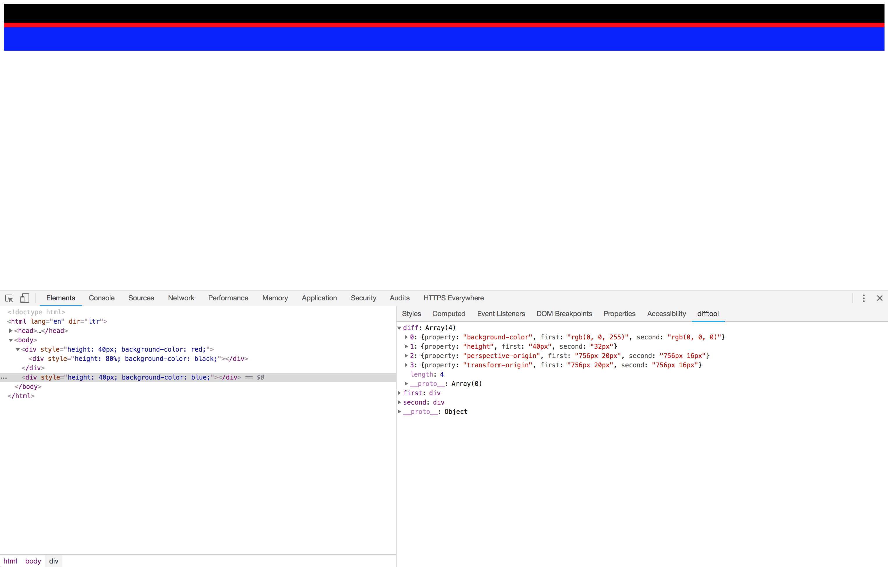

# difftool

This is a chrome devtool extension for easily viewing the style difference between two elements in the `DOM`.

When I have to work on the front-end for something I often find myself manually scrolling through the styles being applied to two elements, trying to find what different styles are being applied. This tool does this automatically.

Disclaimers: 

- There might be a better way to do things that I'm just missing, not being much of a webdev. I'd love to hear about any better methods :-)
- This may not work as intended yet -- please let me know if you find any issues!.

## How to use it

The easiest way to try it out is to add it to chrome through the web store [here](https://chrome.google.com/webstore/detail/devtools-diff/pibbgfbcdndokmmkgjhbgmgklhplblpi). Otherwise, the extension is in `extension`. Visit `chrome://extensions/`, select "Load Unpacked", and select the `extension` directory (after cloning the project). Once you load it, a new sidebar panel will appear in the developer tools, `difftool`. It won't display much before selecting anything, but once at least two elements have been "inspected" (clicked on while inspecting, from within the tools), their diff will appear. It's currently just rendered in json, and should look something like this:

## License

MIT.
